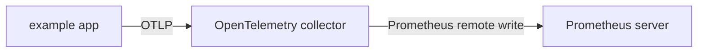

# OpenTelemetry Exporter Example

## Build

This example is built as part of the `client_java` project.

```
./mvnw package
```

## Run

Assuming `./examples/example-exporter-opentelemetry/target/example-exporter-opentelemetry.jar` is present, run the demo with:

```bash
cd ./examples/example-exporter-opentelemetry/
docker-compose up
```

This will set up the following scenario:



The OpenTelemetry collector is configured to log incoming metrics to the console.
The Prometheus server is running on [http://localhost:9090](http://localhost:9090).
